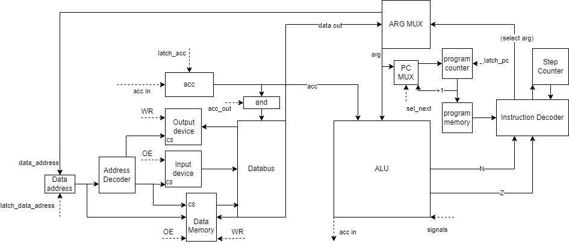

# Лабораторная работа №3 "На кончиках пальцев".

- Попов Андрей Евгеньевич, гр. P33091
- `alg | acc | harv | hw | tick | struct | stream | mem | cstr | prob5 | 8bit` -> 
- Упрощенный `asm | acc | harv | hw | instr | struct | stream | mem | cstr | prob5 | 8bit`

## Язык программирования

```ebnf
program ::= <section_text> | <section_text> <section_data> | <section_data> <section_text>

<section_text> ::= ".section text:\n" <instruction>

<instruction> ::=  <label> | <comand>

<label> ::= "."<name>":"

<name> ::= [a-zA-Z]+

<comand> ::= <no_operand_comand> | <operand_comand>

<no_operand_comand> ::= "HLT" | "NOT" | "NEG" | <compare_family>

<compare_family> ::= "SETG" | "SETE" | "SETL"

<operand_comand> ::= (<jmp_family> | <memory_family> | <math_family> | <logic_family> | "CMP") <arg>

<jmp_family> ::= "JMP" | "JZ" | "JNZ"

<memory_family> ::= "LD" | "ST"

<math_family> ::= "ADD" | "SUB" | "MUL" | "DIV" | "REM"

<logic_family> ::= "OR" | "AND"

<section_data> ::= ".sectrion data:\n" <data>

<data> ::= <name> ":" <value>

<value> ::= <int> | <char> | <string>

<int> ::= [-2^31:2^31]

<char> ::= "'"<ASCII symbol>"'"

<string> ::= """<ASCII symbol>+"""
```
В качестве аргументов поддерживаются:
* Адрес в памяти

### Код находится в `.section text` и выполняется последовательно.
Виды операций:
1. Без операнд:
* `HLT` - завершение программы
* `NOT` - логическое НЕ к аккумулятору, 0 -> 1 или !0 -> 0
* `NEG` - изменить знак аккумулятора, N = !N

Функции сравнения
* `SETE` - set_equal (=), `ACC` = !N and !Z
* `SETG` - set_greater (>), `ACC` = !N and Z
* `SETL` - set_less (<), `ACC` = N and !Z
---
2. С операндой

Функции перехода
* `JMP <arg1>` - безусловный переход к `arg1`
* `JZ <arg1>` - если Z = 1, переход к `arg1`
* `JNZ <arg1>` - если Z = 0, переход к `arg1`

Функции работы с памятью
* `LD <arg1>` - записать из `arg1` в `ACC`
* `ST <arg1>` - записать из аккумулятора в `arg1`

Математические функции
* `ADD <arg1>` - добавить к `ACC` `arg1`
* `SUB <arg1>` - вычесть из `ACC` `arg1`
* `MUL <arg1>` - умножить `ACC` на `arg1`
* `DIV <arg1>` - делить `ACC` на `arg1`
* `REM <arg1>` - остаток от деления `ACC` на `arg1`

Логические функции
* `OR <arg1>` - побитовое ИЛИ `ACC` с `arg1`
* `AND <arg1>` - побитовое И `ACC` с `arg1`

Сравнение
* `CMP <arg1>` - Проставить флаги NZ как при операции `ACC` - `arg1`
---
### Переменные находятся в `.section data`
Синтаксис: `<varname>:<value>`

`<varname>` - имя переменной. Case-sencetive. Имя содержет ислючительно буквенные символы

`<value>` - значение переменной.
* `<int>` - целочисленное значение [-2*31:2^31]
* `<char>` - символ таблицы ASCII
* `<string>` - Массив символов ASCII.

Зарезервированные переменные:
`#STDIN` `#STDOUT`, Перенапрваление вывода в stdin и stdout соответственно

## Организация памяти

```Registers
+------------------------------+
| acc                          |
+------------------------------+

       Instruction memory
+------------------------------+
| 00  : program start          |
|    ...                       |
+------------------------------+

          Data memory
+-------------------------------+
| 0x10000000 : input addr(MMIO) |
| 0x10000001 : output addr(MMIO)|
|    ...                        |
| 0x20000000 : string literal 1 |
|    ...                        |
| 0x2000000F : string literal 1 |
|    ...                        |
| 0x30000000 : variable 1       |
| 0x30000001 : tmp_expr 1       |
| 0x30000002 : tmp_expr 2       |
| 0x30000003 : variable 2       |
|    ...                        |
+-------------------------------+
```

Аккумуляторная, гарвардская архитектура. Виды адресации:

* Непосредственная(Immediate) - аргумент закодирован в команде
* Прямая(Direct) - аргумент находится по адресу, указанному в команде
* Косвенная(Indirect) - аргумент находится по адресу, который находится по адресу, указанному в команде.

* Динамическая память как таковая отсутствует. Существует лишь статическая(можно выделить место под строковый буфер), которая хранится в том же сегменте, что и данные литералов, и автоматическая(память, которая автоматически выделяется компилятором под переменные и временные значения выражений), для нее представлен отдельный сегмент. Под каждую переменную выделяется ровно одно слово.

## Система команд
```python3 translation.py <source> <target>```

* Транслятрор принимает ассемблерный код, парсит его и записывает в целевой файл.

## Модель процессора
```python3 machine.py <code> <input_file>```

* Процессор принимает файл машинных инструкций первым файлом и файл ввода вторым.

* Моделирование производится по инструкциям, далее потактово, для удобства вывода лога. Которое выбрасывается по команде HLT или окончании буффера.

* Каждый тик происходит один из этапов исполнения команды:
  1. Цикл выборки инструкции. защелкивается значения счетчика инструкций(оно зависит от прошлой команды, в частности от сигнала на мультиплексоре sel_next) читается новая команда и на мультиплексоре выбора следующей инструкции устанавливается значение инкремента(то есть если команда ничего не изменит следующей командой будет следующая по счету). Также на этом этапе сбрасываются сигналы OE, WR и ACC_OUT для Datapath и на мультиплексоре выбора аргумента устанавливается значение непосредственной адресации. Цикл всегда длится 1 такт
  2. Цикл выборки операнды. может быть пропущен если аргумент отсутствует или используется непосредственная адресация. Если используется прямая адресация, то значение аргумента устанавливается в значении адреса(защелкивается) и выставляется сигнал OE, цикл занимает 1 такт. Если используется косвенная адресация, то действия повторяются еще один раз и цикл занимает 2 такта.
  3. Цикл исполнения. на этом этапе на линии аргумента находится значение аргумента команды. Во время него происходит непосредственное исполнения. На этом этапе, посылаются сигналы для АЛУ, аргументы проходят через него и защелкивается новое значение аккумулятора. Может происходить запись в память(команда ST). Также во время этого цикла устанавливаются флаги NZ. Этот цикл всегда длится 1 такт.


